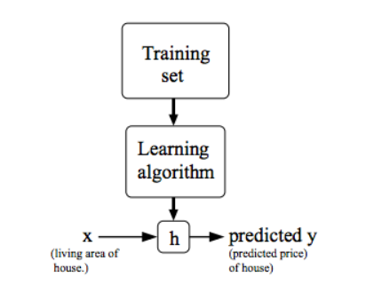
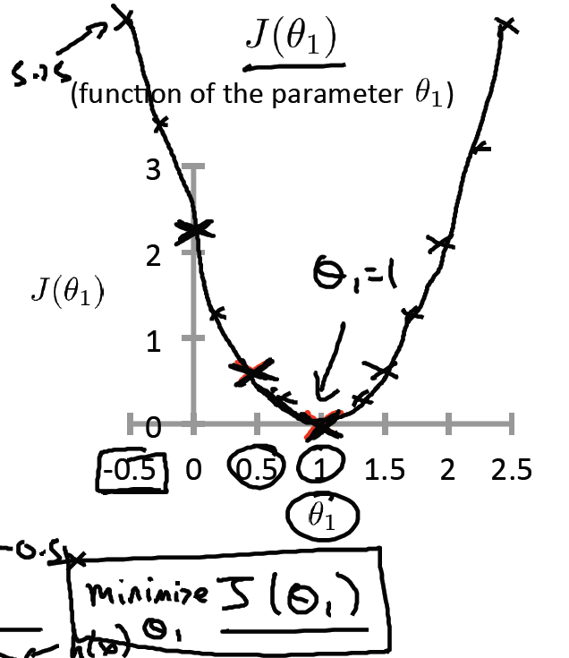
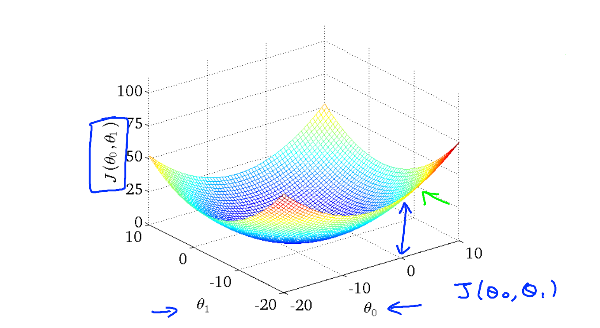
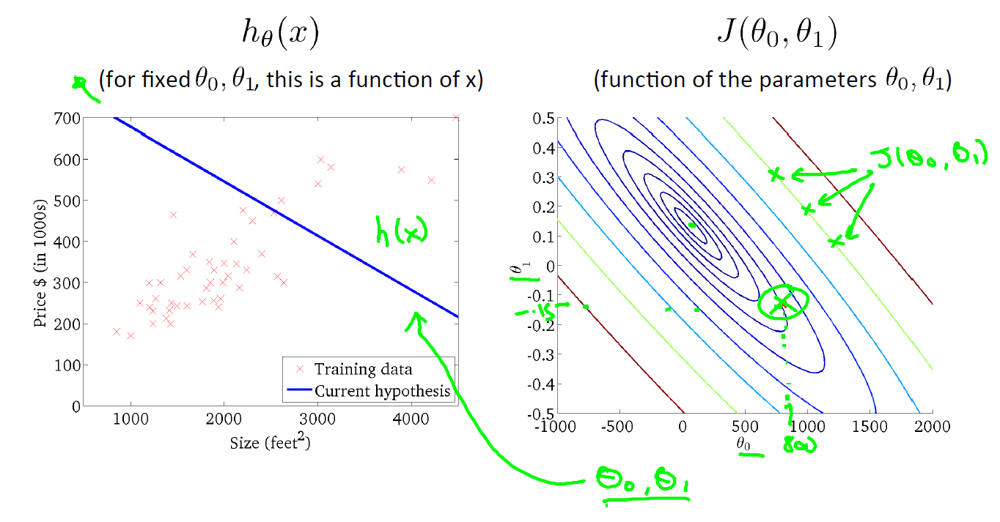
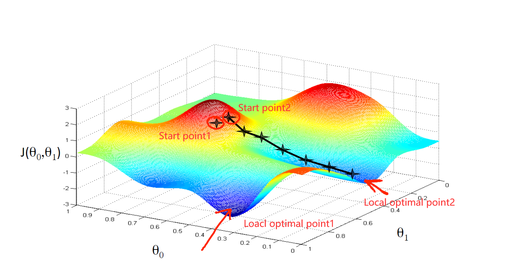
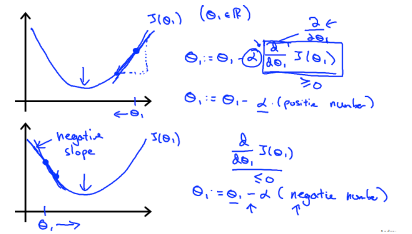
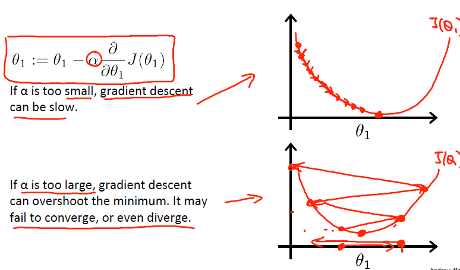

# Machine Learning ——Week 1

## <font color=#990000>Foreword</font>

在写机器学习的学习笔记之前呢，必须要吹一波最近的偶像，Andrew Ng吴恩达。

很早之前看了点儿Stanford CS229 Machine Learning，听说是Stanford报名人数最多的课，Andrew魅力实在太大了。因为一些原因（懒），看了一课时之后就弃了，然后这次选了难度低很多的Coursera上的也是Andrew的Machine Learning（Coursera就是Andrew创办的），因为针对小白，所以英文用词上也会简单很多，听起来不会很累，但是还是CS229里面的Andrew更有魅力hhhhh

Andrew是Stanford终身教授，Coursera和Google Brain的创始者，担任过百度首席科学家。

Andrew的外表就符合我的审美，穿衬衫、爱笑，翩翩君子、温文尔雅。在Coursera上他最喜欢说的话应该就是Don't worry about that，语速不快，声音很温柔，给人的感觉很踏实。其次他爱写板书，我觉得板书是上课的仪式感，比起一页页地刷PPT，板书是有温度的。Andrew在CS229上会边写板书边笑着跟同学互动！

最后是在知乎上看到的一条对他的评价直戳我心：

> 忽然想到一个画面，当时NG还在百度。有一天提前下班和老友吃饭，回来时走西门，然后发现马路对面有一个提着包的人好熟悉，定睛一看原来是NG，当时他在抬头看晚霞，然后就笑了，那一刹那觉得科学家心里肯定住着一个孩子。

一个伟大的科学家工程师一定有个哲学家的灵魂，是有感情有审美的。

希望在学术上一点一点地进步，更重要的是做一个有灵魂有温度的工程师。

## <font color=#990000>What is machine learning</font>

> Tom Mitchell provides a more modern definition: "A computer program is said to learn from experience E with respect to some class of tasks T and performance measure P, if its performance at tasks in T, as measured by P, improves with experience E."
>
> Example: playing checkers.
>
> E = the experience of playing many games of checkers
>
> T = the task of playing checkers.
>
> P = the probability that the program will win the next game.

个人觉得，比起下棋的这个例子，区分垃圾邮件的例子可以更好地帮助理解E、T、P：

- **E(experience)**: Watching people label emails as spam or not spam.
- **T(task)**: Classifying emails as spam or not.
- **P(performance)**: The number(or fraction) of emails correctly classified as spam or not.

Machine Learning主要分成了两类：监督学习和非监督学习，下面是对两者的简单理解：

- **Supervised Learning**: Teach computer to do sth

- **Unsupervised Learning**: Let computer learn by itself without label

## <font color=#990000>Supervised Learning</font>

> In **supervised learning**, we are given a data set and already know what our correct output should look like, having the idea that there is a relationship between the input and the output.

Supervised Learning和unsupervised learning最重要的区别是 **"right answers" given**，给了足够的samples，等同于上文的E，供电脑学习，通过举一反三得到未知的答案。

Supervised Learning又分成了两类：回归和分类

> In a **regression** problem, we are trying to predict results within a **continuous** output, meaning that we are trying to map input variables to some **continuous** function. 
>
> In a **classification** problem, we are instead trying to predict results in a **discrete** output. In other words, we are trying to map input variables into **discrete** categories. 

两者最重要的区别就是连续性和离散型。根据已知的samples，Regression Algorithm以features为坐标拟合出一个连续的函数，并可以根据这个连续性函数得到具体的值；而Classification Algorithm得到的是离散型的函数，标准是区分好与不好，0或1。

**Two examples:**

- Regression: Given data about the size of houses on the real estate market, try to predict their price.

- Classification: Given a patient with a tumor, we have to predict whether the tumor is malignant or benign. 

## <font color=#990000>Unsupervised Learning</font>

> Unsupervised learning allows us to approach problems with little or no idea what our results should look like. We can derive structure from data where we don't necessarily know the effect of the variables.
>
> We can derive this structure by **clustering** the data based on relationships among the variables in the data.
>
> With unsupervised learning there is no feedback based on the prediction results.

无监督学习最典型的就是聚类分析（Clustering Analysis），从无区别的数据集（without label）中，找到分类规则。

**Two examples:**

- Clustering: Group the news with similar contents.
- Non-clustering: The "Cocktail Party Algorithm", allows you to find structure in a chaotic environment.  (i.e. identifying individual voices and music from a mesh of sounds at a cocktail party).

鸡尾酒会算法名字还挺有意思的，用来区分背景音和人声，Andrew在课上给出的算法是

```matlab
[W,s,v] = svd((repmat(sum(x.*x,1),size(x,1),1).*x)*x');
```

## <font color=#990000>Model Representation</font>

$ m = $number of traning examples

$x's = $ "input" variable / features

$y's = $ "output" variable / "target" variable

$(x,y) =$ one training example

$(x^{(i)},y^{(i)}) = i^{th}$ specific training example 

$(x^{(i)},y^{(i)}), i = 1,2,…,m$ : a training set



对于一元线性回归（Univariate Linear Regression），h可以表示为
$$
h_\theta(x) = \theta_0 +\theta_1x
$$

## <font color=#990000>Cost Function</font>

> We can measure the **accuracy** of our hypothesis function by using a **cost function**. This takes an average difference (actually a fancier version of an average) of all the results of the hypothesis with inputs from x's and the actual output y's.
>
> This function is otherwise called the "Squared error function", or "Mean squared error". 

$$
J(\theta_0,\theta_1) = \frac{1}{2m}\sum_{i=1}^{m}(h_\theta(x^{(i)}) - y^{(i)})^2
$$

这不就是最小二乘法嘛，目标是使拟合值贴近真实值，要注意的是这个cost function函数的变量是$\theta$，而不是$x$！$x^{(i)},y^{(i)}$是已经给出的数据集。

以前看到这个函数的时候不知道它为什么要除2，说是为了方便计算，当时不知道是怎么计算的，这次明白了。为了使$J(\theta_0,\theta_1)$以最快的速度达到最小，要用到梯度下降（Gradient Descent）的概念，这个之后再说。Gradient descent要对$\theta_n$求偏导（Partial Derivatives），所以在求导的时候那个方差上的平方经过偏导之后就和$\frac{1}{2}$抵消了。

- **Hypothesis**
  $$
  h_\theta(x) = \theta_0 +\theta_1x
  $$
  
- **Parameters**
  $$
  \theta_0,\theta_1
  $$
  
- **Cost Function**
  $$
  J(\theta_0,\theta_1) = \frac{1}{2m}\sum_{i=1}^{m}(h_\theta(x^{(i)}) - y^{(i)})^2
  $$
  
- **Goal**
  $$
  minimize\quad J(\theta_0,\theta_1)
  $$

这里假设$\theta_0 = 0$，这样$J(\theta_1) = \frac{1}{2m}\sum_{i=1}^{m}(h_\theta(x^{(i)}) - y^{(i)})^2$，就是一个二元一次方程，有一个全局最优解（gloabl optimal solution），没有局部最优解（local optimal solution）。



当$\theta_0 ≠ 0$时，$J(\theta_0,\theta_1)$的图像就需要用3D进行表示，或者在2D平面上以contour plot的形式表示。



下面的右图就是contour plot（等值线图），一个圈就代表3D上一个等高线。



## <font color=#990000>Gradient Descent</font>

> Imagine that we graph our hypothesis function based on its fields $\theta_0$ and $\theta_1$ (actually we are graphing the cost function as a function of the parameter estimates). We are not graphing x and y itself, but the parameter range of our hypothesis function and the cost resulting from selecting a particular set of parameters.

梯度下降是一种迭代算法，是通过同时改变$\theta_0,\theta_1$的值来得到$J(\theta_0,\theta_1)$的最小值，也就是最优解。

**Outline**:

- Start with some $\theta_0,\theta_1$
- Keep changing $\theta_0,\theta_1$ to reduce $J(\theta_0,\theta_1)$ until we hopefully end up at a minimum
- The minimum of $J(\theta_0,\theta_1)$ is the green point in the middlemost circle



两种“=”的区别：

- := 是赋值
- =  是判断

**Gradient descent algorithm**:
$$
repeat\ until\ convergence\{\quad\quad
	\theta_j:=\theta_j - \alpha{\frac{\partial}{\partial\theta_j}J(\theta_0,\theta_1)}
\quad\quad\}
$$
其中$\alpha$被称为learning rate，这个算法最最最关键的地方是对于$\theta_0,\theta_1…$必须**Simultaneously Update**！

当只有$\theta_0,\theta_1$时，计算如下：
$$
\begin{cases}
temp0:=\theta_0 - \alpha{\frac{\partial}{\partial\theta_0}J(\theta_0,\theta_1)}\\
temp1:=\theta_1 - \alpha{\frac{\partial}{\partial\theta_1}J(\theta_0,\theta_1)}
\end{cases}
$$

$$
\begin{cases}
\theta_0:=temp0\\
\theta_1:=temp1\\
\end{cases}
$$

此时若$\theta_0=0$，公式如下，这时就是对$\theta_1$的普通求导。
$$
repeat\ until\ convergence\{\quad\quad
	\theta_1:=\theta_1 - \alpha{\frac{d}{d\theta_1}J(\theta_0,\theta_1)}
\quad\quad\}
$$



若$\theta_0≠0$，对于$J(\theta_0,\theta_1)$，得到的公式如下：
$$
repeat\ until\ convergence:{
\begin{cases}
\theta_0:=\theta_0 - \alpha\frac{1}{m}\sum_{i=1}^{m}(h_\theta(x_i)-y_i)\\
\theta_1:=\theta_1 - \alpha\frac{1}{m}\sum_{i=1}^{m}((h_\theta(x_i)-y_i)x_i)\\
\end{cases}
}
$$
Linear Regression always turn to be a bow shaped function, which is also called convex function, and only have global optima without lcoal optima.

接下来就是关于learning rate $\alpha$的讨论：

> On a side note, we should adjust our parameter $\alpha$ to ensure that the gradient descent algorithm converges in a reasonable time. **Failure to converge** or **too much time to obtain the minimum value** imply that our step size is wrong.

$\alpha$太小或太大有以下两种情况：



当我们越来越接近全局或是局部最优解时，求偏导的结果会越来越小，即切线越来越平，此时梯度下降的幅度也会越来越小，直到偏导的结果是0。所以无需减小$\alpha$的值，不会错过最优解。

Batch gradient descent:

> his method looks at every example in the entire training set on every step, and is called **batch gradient descent**. 

## <font color=#990000>Vector</font>

Vector is an $n × 1$ matrix, which is also called $n$-dimensional vector.

Example which could be indicated as $\mathbb{R}^{3}$: 
$$
\begin{bmatrix}
1\\
2\\
3\\
\end{bmatrix}
$$
**Vector Elements**:$A_{i}=i^{th}$ element

## <font color=#990000>Matrix</font>

Matrix is a rectangular array of numbers.

**Dimension of matrix**: number of rows times number of columns.

Example which could be indicated as $\mathbb{R}^{2×3}$: 
$$
\begin{bmatrix}
1&2&3\\
4&5&6\\
\end{bmatrix}
$$
**Matrix Elements**: $A_{ij}=$ "$i,j$ entry" in the $i^{th}$ row, $j^{th}$ column.

- Matrix Addition

- Scalar Multiplication(scalar means real number)

- Combination of Operands

- **Matrix-Vector Multiplication**

  $m × n$ matrix times $n × 1$ matrix($n$-dimensional vector) is equal to $m$-dimensional vector.

- **Matrix-Matrix Multiplication**

  $m × n$ matrix A times $n × o$ matrix B is equal to $m × o$ matrix C. We could take $n × o$ matrix B as some $n$-dimensional vectors, and multiply matrix and vector seperately. The $i^{th}$ column of matrix C is obtained by multiplying A with the $i^{th}$ column of B.

- **Matrix multiplication properties**

  1. Not commutative:  $A × B ≠ B × A$

  2. Associateive: $(A × B) × C = A × (B × C)$

  3. Identity Matrix: Denoted $I$(or $I_{n×n}$).

     Example of identity matrices:
     $$
     \begin{bmatrix}
     1&0&0\\
     0&1&0\\
     0&0&1\\
     \end{bmatrix}
     $$
     $A × I = I × A = A$

- **Matrix Inverse**

  Not all numbers of matrix have an inverse.

  Matrix A must to be $m × m$, and if it has an inverse:

  $A(A^{-1}) = A^{-1}A = I$

  Matrices that don't have an inverse are **singular** or **degenerate**.

  The code in Matlab:

  ```matlab
  A_inv = inv(A)
  ```

- **Matrix Transpose**

  The transposition of a matrix is like rotating the matrix 90**°** in clockwise direction and then reversing it. 

  Example:
  $$
  A =\begin{bmatrix}
  1&2&3\\
  4&5&6\\
  \end{bmatrix}
  $$

  $$
  B = A^T =\begin{bmatrix}
  1&2\\
  3&4\\
  5&6\\
  \end{bmatrix}
  $$

  The code in Matlab:

  ```matlab
  A_trans = A'
  ```

## <font color=#990000>Conclusion</font>

我终于写完了！

**Enjoy the weekend！**