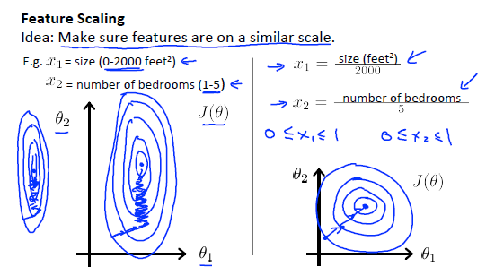

# Machine Learning ——Week 2

## <font color=#990000>Foreword</font>

原来想做完Week2的作业之后再来写的，但是发现我不会做……所以边写边复习了。好久没有这种被作业支配的烦躁感了，啊啊啊啊啊。

## <font color=#990000>MATLAB Online</font>

Andrew推荐了两款软件，Octave和MATLAB，Octave开源免费，MATLAB要钱，不过可以使用MATLAB Online Licenses免费完成这门课的作业，于是我选择了MATLAB Online来做作业。

怎么在MATLAB Online上做作业并且提交可以看[Coursera Machine Learning如何提交MATLAB Online作业][matlab online]。

## <font color=#990000>Multiple Features</font>

The multivariable form of the hypothesis function is as follows:
$$
h_\theta(x) = \theta_0 + \theta_1x_1 + \theta_2x_2 + … + \theta_nx_n
$$
For convenience of notation, define $x_0 = 1$ to make the two vectors $\theta$ and $X$ match each other element-size.
$$
h_\theta(x) = \theta_0x_0 + \theta_1x_1 + \theta_2x_2 + … + \theta_nx_n
$$
**Notation**:

- $x^{(i)} = $ input(features) of $i^{th}$ training example.

  It is a **vector** describing the feature of one training example.

- $x^{(i)}_j = $ value of feature $j$ in $i^{th}$ training example.

  It is a **real number**.

- $x^{(i)} = \begin{bmatrix}x_0^{(i)}\\x_1^{(i)}\\x_2^{(i)}\\…\\x_n^{(i)}\end{bmatrix} \in \mathbb{R^{n+1}}$，$x^{(i)}_0 = 1$
- $\theta = \begin{bmatrix}\theta_0\\\theta_1\\\theta_2\\…\\\theta_n\end{bmatrix} \in \mathbb{R^{n+1}}$

So $h_\theta(x)$ could be decribed by vector as follows:
$$
h_\theta(x) = \theta^Tx
$$

## <font color=#990000>Gradient descent for multiply variables</font>

- **Hypothesis**:
  $$
  h_\theta(x) = \theta^Tx = \theta_0x_0 + \theta_1x_1 + \theta_2x_2 + … + \theta_nx_n
  $$

- **Parameters**:
  $$
  \theta = \begin{bmatrix}\theta_0\\\theta_1\\\theta_2\\…\\\theta_n\end{bmatrix} \in \mathbb{R^{n+1}}
  $$

- **Cost Function**:
  $$
  J(\theta) = \frac{1}{2m}\sum_{i=1}^{m}(h_\theta(x^{(i)}) - y^{(i)})^2
  $$

- **Gradient Descent**:
  $$
  repeat\{\quad\quad
  	\theta_j:=\theta_j - \alpha{\frac{\partial}{\partial\theta_j}J(\theta)}
  \quad\quad\}
  $$
  It is the same as:
  $$
  repeat\{\quad\quad
  	\theta_j:=\theta_j - \alpha\frac{1}{m}\sum_{i=1}^{m}((\theta^Tx^{(i)}-y^{(i)})x^{(i)}_j)
  \quad\quad\}\quad x^{(i)}_0 = 1
  $$
  Simulaneously update $\theta_j$ for every $j = 0,1,…，n$.

## <font color=#990000>Feature Scaling & Mean Normalization</font> 

**Key Point: Make sure features are on a similar scale.**

> We can speed up gradient descent by having each of our input values in roughly the same range. This is because θ will descend quickly on small ranges and slowly on large ranges, and so will oscillate inefficiently down to the optimum when the variables are very uneven.

当数据集中$x_1$的值比$x_2$大几十几百倍时，在梯度下降的过程中，当$\theta_1$和$\theta_2$改变同样大小时，$J$在$\theta_1$的方向上变化更加剧烈，contour plot更陡。



There are two methods to realize the quick descent of $\theta$: Feature Scaling and Mean Normalization.

> **Feature scaling** involves dividing the input values by the ***range*** (i.e. the maximum value minus the minimum value) of the input variable, resulting in a new range of just 1. 
>
> **Mean normalization** involves ***subtracting the average value*** for an input variable from the values for that input variable resulting in a new average value for the input variable of just zero. 

- **Feature Scaling**
  $$
  x_i := \frac{x_i}{\max(x_i)}
  $$
  This method gets every feature into approximately a  $-1 ≤ x_{j} ≤ 1$ range.

  e.g. As the picture shown above.

- **Mean Normalization**
  $$
  x_i := \frac{x_i - \mu_i}{s_i}
  $$
  Where $\mu_i$ is the ***average*** of all the values for feature (i) and $s_i$ is the ***range*** of values (max - min), or $s_i$ is the ***standard deviation***.

  This method make features have approximately zero mean(Do not apply to $x_0 = 1$)

  e.g. if $x_i$ represents housing prices with a range of 100 to 2000  and a mean value of 1000, then, then, $x_i := \frac{price - 1000}{1900}$.

## <font color=#990000>Learning Rate</font> 

> **Debugging gradient descent.** Make a plot with *number of iterations* on the x-axis. Now plot the cost function, $J(\theta)$ over the number of iterations of gradient descent. If $J(\theta)$ ever increases, then you probably need to decrease $\alpha$.
>
> **Automatic convergence test.** Declare convergence if $J(\theta)$ decreases by less than E in one iteration, where E is some small value such as $10^{-3}$. However in practice it's difficult to choose this threshold value.

**Summarization**:

- If $\alpha$ is too small: slow convergence.
- If $\alpha$ is too large: may not decrease on every iteration and thus may not convergence.

To choose $\alpha$, try: $…,0.001,0.003,0.01,0.03,0.1,0.3,1,…$

## <font color=#990000>Polynomial Regression</font>

We can make our hypothesis function a **quadratic**, **cubic** or **square root** function.

One important thing to keep in mind is, if you choose your features this way then feature scaling becomes very important.

eg. if $x_1$ has range 1 - 1000 then range of $x_1^2$ becomes 1 - 1000000 and that of $x_1^3$ becomes 1 - 1000000000.

## <font color=#990000>Normal Equation</font>

It is a method to solve for $\theta$ analytically and feature scaling doesn't matter here.
$$
\theta = (X^TX)^{-1}X^Ty
$$
The code in Matlab:

```matlab
theta = inv(X'*X)*X'*y
```

**Notations**:

- $m$ examples: $(x^{(1)},y^{(1)}),(x^{(2)},y^{(2)}),…,(x^{(m)},y^{(m)})$
- $n$ features

- $x^{(i)} = \begin{bmatrix}x_0^{(i)}\\x_1^{(i)}\\x_2^{(i)}\\…\\x_n^{(i)}\end{bmatrix} \in \mathbb{R^{n+1}}$

- $X=\begin{bmatrix}——(x^{(1)})^T——\\——(x^{(2)})^T——\\…\\——(x^{(m)})^T——\end{bmatrix}$
- $y = \begin{bmatrix}y^{(1)}\\y^{(2)}\\…\\y^{(m)}\end{bmatrix}$

e.g. If $x^{(i)} = \begin{bmatrix}1\\x_1^{(i)}\end{bmatrix}$, then, $X = \begin{bmatrix}1\quad x_1^{(1)}\\1\quad x_1^{(2)}\\……\\1\quad x_1^{(m)}\\\end{bmatrix}$

**Comparsion of gradient descent and normal equation**:

| Gradient Descent           | Normal Equation                               |
| -------------------------- | --------------------------------------------- |
| Need to choose $\alpha$    | No need to choose $\alpha$                    |
| Need many iterations       | No need to iterate                            |
| Works well when n is large | Slow if n is large beacuse of $(X^TX)^{(-1)}$ |
| Complexity $O(kn^2)$       | Complexity $O(n^3)$                           |

Normal equation could be useful only when $X^TX$ is invertible, otherwise, the common causes might be having:

- Redundant features, where two features are very closely related (i.e. they are linearly dependent).
- Too many features (e.g. m ≤ n). In this case, delete some features or use "regularization".

## <font color=#990000>Basic Codes in Matlab</font>

```matlab
v = 1:0.1:3;
a = ones(2,3);
b = zero(2,3);
c = eye(4);			% Identity matrix
d = rand(1,3);		% 3 random numbers between 0 and 1
e = size(a,2);		% return the 2-dim (column) number of a
f = length(a);		% return the column number of a
g = a(2,:);			% get every element along that row or column
h = a + ones(length(a),1);
[val,ind] = max(a);
[r,c] = find(a < 3);
i = magic(3);		% all of their rows, columns and diagonals sum up to the same
j = sum(a);
k = prod(a);		% multiplication
l = floor(a);		% rounds down
m = ceil(a);		% rounds up
n = round(a);		% rounds off
o = flipud(eye(9));	% permutation
```

## <font color=#990000>Conclusion</font>

全部写完了之后发现还是不太会做……罢了……

终于是坎坎坷坷地做完了作业！

[matlab online]:https://blog.csdn.net/weixin_42150654/article/details/115116254